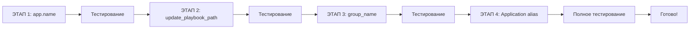

# План рефакторинга для удаления алиасов старой модели данных

**Дата создания**: 2025-11-17
**Статус**: 📋 ПЛАН РАЗРАБОТАН
**Версия**: 1.0

---

## Обзор текущих алиасов

### Активные алиасы, требующие удаления:

1. **`Application = ApplicationInstance`** - класс-алиас (11 файлов, ~100+ использований)
2. **`app.name`** - @property алиас (23 использования)
3. **`app.group_name`** - @property алиас (используется frontend)
4. **`app.update_playbook_path`** - @property алиас (1 использование + группы)

---

## ЭТАП 1: Замена `app.name` → `app.instance_name`

### Приоритет: ВЫСОКИЙ
### Сложность: НИЗКАЯ
### Риск: НИЗКИЙ
### Время: 30-45 минут

### 1.1. Файлы для изменения (23 использования):

| Файл | Строки | Количество |
|------|--------|------------|
| `app/api/applications_routes.py` | 44, 95, 204, 350, 352, 363, 462, 477, 533, 551, 594 | 11 |
| `app/api/app_groups_routes.py` | 115, 226, 499, 652 | 4 |
| `app/api/nexus_routes.py` | 299, 319, 326, 358, 378 | 5 |
| `app/api/ansible_routes.py` | 210, 294 | 2 |
| `app/api/servers_routes.py` | 224 | 1 |

### 1.2. План действий:

```bash
# 1. Резервное копирование
cp -r app/api app/api.backup_before_name_refactor

# 2. Замена в каждом файле
# Паттерн замены: app.name → app.instance_name
# ВАЖНО: НЕ заменять group.name!
```

### 1.3. Детальные изменения по файлам:

#### applications_routes.py
```python
# Строка 44
- 'name': app.name,
+ 'name': app.instance_name,

# Строка 95
- 'name': app.name,
+ 'name': app.instance_name,

# Строка 204
- logger.info(f"Остановка приложения {app.name} на сервере {app.server.name}")
+ logger.info(f"Остановка приложения {app.instance_name} на сервере {app.server.name}")

# И так далее для всех строк...
```

### 1.4. После замены:

1. Удалить @property из `app/models/application_instance.py`:
```python
# УДАЛИТЬ строки 122-125:
@property
def name(self):
    """Алиас для обратной совместимости с кодом, использующим app.name"""
    return self.instance_name
```

2. Обновить `to_dict()` метод в ApplicationInstance (строка 226):
```python
# Удалить дублирование:
- 'name': self.instance_name,  # Для обратной совместимости
```

---

## ЭТАП 2: Замена `app.update_playbook_path` → `app.get_effective_playbook_path()`

### Приоритет: СРЕДНИЙ
### Сложность: НИЗКАЯ
### Риск: НИЗКИЙ
### Время: 15 минут

### 2.1. Файл для изменения:

| Файл | Строка | Использование |
|------|--------|---------------|
| `app/api/applications_routes.py` | 103 | `'update_playbook_path': app.update_playbook_path,` |

### 2.2. План действий:

```python
# applications_routes.py, строка 103
- 'update_playbook_path': app.update_playbook_path,
+ 'update_playbook_path': app.get_effective_playbook_path(),
```

### 2.3. После замены:

Удалить @property из `app/models/application_instance.py`:
```python
# УДАЛИТЬ строки 127-130:
@property
def update_playbook_path(self):
    """Алиас для обратной совместимости - возвращает эффективный путь к playbook"""
    return self.get_effective_playbook_path()
```

### 2.4. Важное замечание:

⚠️ НЕ ТРОГАТЬ `group.update_playbook_path` в ApplicationGroup - это реальное поле, не алиас!

---

## ЭТАП 3: Рефакторинг `app.group_name` для frontend

### Приоритет: ВЫСОКИЙ
### Сложность: СРЕДНЯЯ
### Риск: СРЕДНИЙ (затрагивает frontend)
### Время: 1-2 часа

### 3.1. Анализ использования:

Frontend ожидает поле `group_name` в JSON ответах от API.

### 3.2. Варианты решения:

#### Вариант A: Добавить явное поле в to_dict() (РЕКОМЕНДУЕТСЯ)

```python
# app/models/application_instance.py, метод to_dict()
def to_dict(self, include_group=False, include_settings=False):
    result = {
        'id': self.id,
        'instance_name': self.instance_name,
        # Добавить явное вычисление group_name
        'group_name': self.group.name if self.group else None,
        # ...
    }
```

#### Вариант B: Обновить frontend для использования вложенного объекта

```javascript
// Вместо: app.group_name
// Использовать: app.group ? app.group.name : null
```

### 3.3. План действий (Вариант A):

1. Найти все места в API, где возвращается ApplicationInstance.to_dict()
2. Убедиться, что `group_name` включен в результат
3. Удалить @property после проверки

### 3.4. После реализации:

Удалить @property из `app/models/application_instance.py`:
```python
# УДАЛИТЬ строки 274-279:
@property
def group_name(self):
    """Получить имя группы приложения"""
    if self.group:
        return self.group.name
    return self.base_name  # Этот base_name уже удален!
```

---

## ЭТАП 4: Удаление класс-алиаса `Application = ApplicationInstance`

### Приоритет: НИЗКИЙ (финальный этап)
### Сложность: ВЫСОКАЯ
### Риск: ВЫСОКИЙ
### Время: 3-4 часа

### 4.1. Файлы с алиасом (11 файлов):

1. `app/models/__init__.py` - центральное определение
2. `app/api/applications_routes.py`
3. `app/api/artifacts_routes.py`
4. `app/api/app_groups_routes.py`
5. `app/api/tasks_routes.py`
6. `app/api/servers_routes.py`
7. `app/api/nexus_routes.py`
8. `app/api/ansible_routes.py`
9. `app/services/agent_service.py`
10. `app/services/haproxy_mapper.py`
11. `app/services/eureka_mapper.py`

### 4.2. План действий:

#### Шаг 1: Замена импортов

```python
# БЫЛО:
from app.models import Application
# или
Application = ApplicationInstance

# СТАЛО:
from app.models import ApplicationInstance
```

#### Шаг 2: Замена использования в коде

```python
# БЫЛО:
app = Application.query.get(app_id)
apps = Application.query.filter_by(server_id=server_id).all()

# СТАЛО:
app = ApplicationInstance.query.get(app_id)
apps = ApplicationInstance.query.filter_by(server_id=server_id).all()
```

### 4.3. Детальный список замен по файлам:

#### app/models/__init__.py
```python
# Строка 13 - УДАЛИТЬ:
- Application = ApplicationInstance  # Алиас для обратной совместимости

# Строка 21 - обновить экспорт:
- __all__ = ['db', 'Server', 'Application', 'ApplicationInstance', ...]
+ __all__ = ['db', 'Server', 'ApplicationInstance', ...]
```

#### app/api/applications_routes.py
```python
# Строка 14:
- from app.models import Server, Application, ApplicationInstance, ApplicationGroup
+ from app.models import Server, ApplicationInstance, ApplicationGroup

# Все использования Application заменить на ApplicationInstance
# Примерно 20-30 замен
```

### 4.4. Автоматизация замены:

```bash
# Скрипт для массовой замены
#!/bin/bash

# 1. Заменить импорты
find app/ -name "*.py" -type f -exec sed -i 's/from app.models import.*Application[,\s]/from app.models import ApplicationInstance/g' {} \;

# 2. Заменить использование
find app/ -name "*.py" -type f -exec sed -i 's/\bApplication\./ApplicationInstance./g' {} \;
find app/ -name "*.py" -type f -exec sed -i 's/\bApplication(/ApplicationInstance(/g' {} \;

# 3. Удалить строки с алиасом
find app/ -name "*.py" -type f -exec sed -i '/^Application = ApplicationInstance/d' {} \;
```

---

## ЭТАП 5: Проверка и тестирование

### Приоритет: КРИТИЧЕСКИЙ
### Время: 1-2 часа

### 5.1. После каждого этапа:

1. **Перезапустить приложение**
   ```bash
   docker restart fak-apps
   ```

2. **Проверить логи на ошибки**
   ```bash
   docker logs fak-apps --tail 100
   ```

3. **Функциональное тестирование**
   - Список приложений
   - Детали приложения
   - Обновление приложения
   - Управление группами
   - Получение артефактов

### 5.2. Регрессионное тестирование:

#### API endpoints для проверки:
```bash
# 1. Список приложений
curl http://localhost:5000/api/applications

# 2. Детали приложения
curl http://localhost:5000/api/applications/{id}

# 3. Группы приложений
curl http://localhost:5000/api/application-groups

# 4. Артефакты
curl http://localhost:5000/api/applications/{id}/artifacts
```

#### Frontend функции для проверки:
1. Отображение списка приложений
2. Детали приложения (проверить group_name)
3. Обновление приложения
4. Управление группами
5. Просмотр артефактов

---

## Порядок выполнения этапов

### Рекомендуемая последовательность:



### Временные оценки:

| Этап | Время разработки | Время тестирования | Итого |
|------|------------------|-------------------|--------|
| ЭТАП 1 | 30-45 мин | 15 мин | 1 час |
| ЭТАП 2 | 15 мин | 10 мин | 25 мин |
| ЭТАП 3 | 1-2 часа | 30 мин | 2.5 часа |
| ЭТАП 4 | 3-4 часа | 1 час | 5 часов |
| ЭТАП 5 | - | 1-2 часа | 2 часа |
| **ИТОГО** | | | **~11 часов** |

---

## Резервное копирование

### Перед началом работ:

1. **Создать полный бэкап кода**
   ```bash
   tar -czf app_backup_$(date +%Y%m%d_%H%M%S).tar.gz app/
   ```

2. **Создать точку восстановления в git**
   ```bash
   git add -A
   git commit -m "Backup before alias removal refactoring"
   git tag backup-before-alias-removal
   ```

3. **Экспортировать схему БД**
   ```bash
   docker exec fak-postgres pg_dump -U fappcontrol -s fappcontrol > schema_backup.sql
   ```

---

## Риски и митигация

### Риск 1: Нарушение работы frontend
**Митигация**: Тщательное тестирование после ЭТАПА 3

### Риск 2: Пропущенные использования Application
**Митигация**: Использовать grep для поиска всех вхождений перед удалением

### Риск 3: Проблемы с обратной совместимостью
**Митигация**: Поэтапное выполнение с тестированием после каждого этапа

### Риск 4: Ошибки в продакшене
**Митигация**: Сначала выполнить на dev/staging окружении

---

## Контрольный чеклист

### Перед началом:
- [ ] Создан полный бэкап
- [ ] Создана git точка восстановления
- [ ] Уведомлена команда о рефакторинге
- [ ] Подготовлено тестовое окружение

### После ЭТАПА 1:
- [ ] Все 23 использования app.name заменены
- [ ] @property name удален
- [ ] Приложение запускается
- [ ] API endpoints работают
- [ ] Frontend отображает данные

### После ЭТАПА 2:
- [ ] update_playbook_path заменен
- [ ] @property удален
- [ ] Playbook пути корректно определяются

### После ЭТАПА 3:
- [ ] group_name корректно возвращается в API
- [ ] Frontend отображает имена групп
- [ ] @property удален

### После ЭТАПА 4:
- [ ] Все импорты обновлены
- [ ] Все использования Application заменены
- [ ] Алиас удален из __init__.py
- [ ] Нет ошибок импорта

### Финальная проверка:
- [ ] Полное регрессионное тестирование пройдено
- [ ] Документация обновлена
- [ ] Изменения закоммичены в git
- [ ] Создан PR для review

---

## Ожидаемые результаты

### После полного рефакторинга:

1. **Удалено алиасов**: 4
2. **Удалено строк кода**: ~50-60
3. **Упрощенная структура**: Прямое использование ApplicationInstance
4. **Улучшенная читаемость**: Нет скрытых алиасов и @property
5. **Снижение технического долга**: Полная очистка от старой модели

### Метрики успеха:

- ✅ Все тесты проходят
- ✅ Frontend работает корректно
- ✅ API возвращает ожидаемые данные
- ✅ Нет ошибок в логах
- ✅ Производительность не ухудшилась

---

## Альтернативный подход (консервативный)

Если полный рефакторинг слишком рискован, можно выполнить только ЭТАПЫ 1-2:

1. **Удалить только неиспользуемые @property**
2. **Оставить Application алиас** для стабильности
3. **Документировать** оставшиеся алиасы

**Выгода**: Минимальный риск, частичная очистка
**Недостаток**: Технический долг остается

---

## Команда выполнения

### Для начала рефакторинга:

```bash
# 1. Создать бэкап
./create_backup.sh

# 2. Начать с ЭТАПА 1
python refactor_stage1.py

# 3. Тестировать
./run_tests.sh

# 4. Продолжить с следующим этапом
```

---

## Заключение

Данный план обеспечивает систематический подход к удалению всех алиасов от старой модели данных. Поэтапное выполнение с промежуточным тестированием минимизирует риски и позволяет откатить изменения при необходимости.

**Рекомендация**: Выполнять в спокойный период (выходные/ночь), начать с dev окружения.

---

**Автор**: Claude Code
**Дата**: 2025-11-17
**Версия**: 1.0